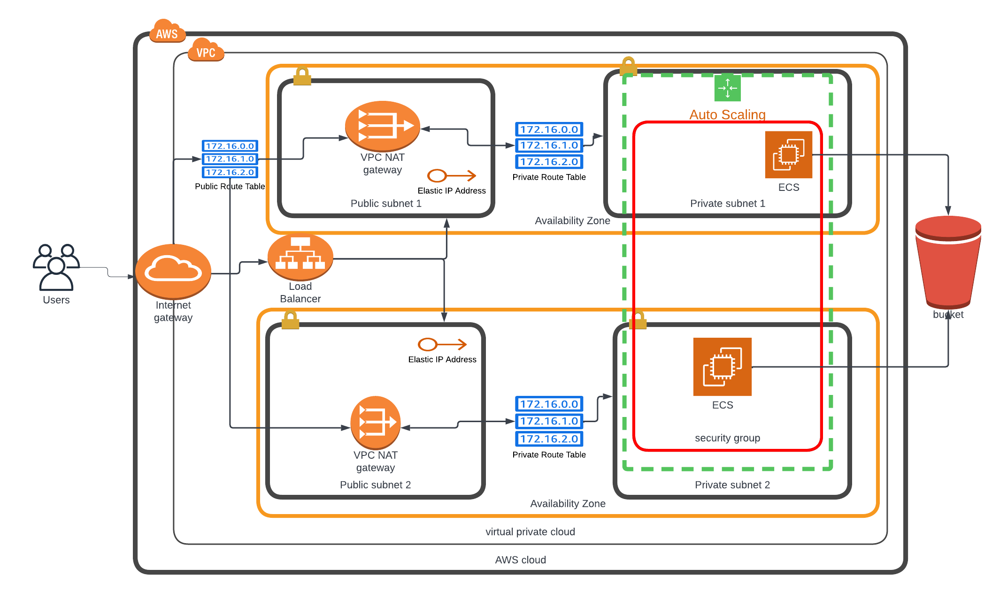

# Deploy a high-availability web app using CloudFormation

In this project, we deployed web servers for a highly available web app using CloudFormation.

## Project Overview

Your company is creating an Instagram clone called Udagram. Developers want to deploy a new application to the AWS infrastructure. 
You have been tasked with provisioning the required infrastructure and deploying a dummy application, along with the necessary supporting software.

## Diagram of the Infrastructure



## Project Files
- `create.sh`: This contains script to create CloudFormation stack
- `update.sh`: This contains script to update CloudFormation stack
- `Udagram Diagram.png`: This describes the architecture diagram of this project.
- `ourinfra.yml`: CloudFormation template for creating networking resources for this project.
- `ourinfra-params.json`: Parameters file for servers cloud formation stack.

## Prerequisite
- AWS Account
- Visual Studio
- AWS CLI
- python

## Project Setup

- Create networking resources & servers for ours infrastructure

$ create.sh ourinfraServer ourinfra.yml ourinfra-params.json
```

-   Following resources are created:
    -   VPC
    -   Subnets
    -   Route Tables
    -   Routes
    -   Internet Gateway
    -   NAT Gateways
    -   Security Groups
    -   Instances
    -   Launch configuration
    -   Auto Scaling Group
    -   Load Balancer
    -   Target Group
	
- The URL of application can be find from the outputs section of `ourinfraServer` CloudFormarion stack.
